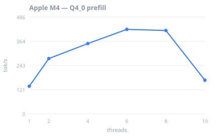
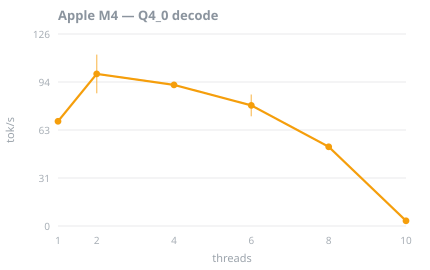
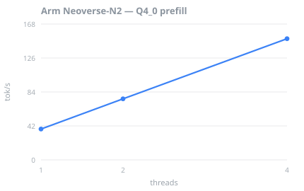
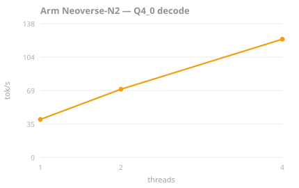
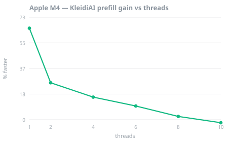

# Measured results

Every number on this page is read out of the JSON artifacts in [`results/`](../results) by [`scripts/build_results.py`](../scripts/build_results.py). Nothing is typed by hand. Rerun that script after any sweep to regenerate the page and its charts.

Model: **Qwen2.5-0.5B-Instruct** (GGUF). Runtime: **llama.cpp** at the commit pinned in the workflow. Workload: **long-context** — a 2048-token prompt with 128 generated tokens. Five repetitions per measurement, with llama-bench doing its own warmup.

## The two machines

| CPU | Cores | Clusters | SVE | SME | RAM |
| --- | ---: | --- | --- | --- | ---: |
| **Apple M4** | 10 (heterogeneous) | 4× Performance + 6× Efficiency | absent | 512-bit | 16 GB |
| **Arm Neoverse-N2** | 4 (uniform) | 4× Neoverse-N2 | 128-bit | absent | 16 GB |

These are structural opposites, which is the point. The M4 has a matrix engine (SME2) and two kinds of core; the Neoverse-N2 has scalable vectors (SVE2) and one kind. A tool that merely swept configurations would produce the same advice for both. A capability model should not.

## The recommendations differ

| Machine | Recommended threads | Why |
| --- | --- | --- |
| Apple M4 | `-t 2` `-tb 6` | prompt processing and token generation peak at different thread counts |
| Arm Neoverse-N2 | `-t 4` `-tb 4` | both phases peak together, so the split collapses to one number |

`-t` sets generation threads and `-tb` sets prompt-processing threads; llama.cpp accepts them separately, so the split is directly deployable.

## Finding 1 — core topology decides the thread count

 

 

On the Apple M4, decode peaks at **2 threads** (99.5 tok/s) and collapses to **3.4 tok/s** at 10 threads — a **29× drop** at exactly the value `nproc` reports. Prefill peaks elsewhere, at 6 threads.

On the Arm Neoverse-N2 that collapse does not happen: scaling is close to linear and **4 threads — every core — is best for both phases**.

This was registered as a prediction before the Neoverse sweep ran. The collapse is an artifact of heterogeneity: efficiency cores stall a thread pool that waits on its slowest member. A uniform CPU has no slow cluster to wait for. Had the collapse appeared on Neoverse too, the explanation would have been wrong.

## Finding 2 — Q4_0 beats Q4_K_M for prompt processing

| Machine | Q4_0 prefill | Q4_K_M prefill | Ratio |
| --- | ---: | ---: | ---: |
| Apple M4 | 424.3 ± 9.5 (6t) | 186.1 ± 1.7 (8t) | **2.28×** |
| Arm Neoverse-N2 | 149.8 ± 0.1 (4t) | 87.0 ± 0.0 (4t) | **1.72×** |

llama.cpp repacks Q4_0 weights at load time into a blocked layout that feeds the `SMMLA` int8 matrix instruction; the K-quants have no such path. Both CPUs report `FEAT_I8MM`, so both benefit — the M4 more, consistent with it also having SME2 while the Neoverse-N2 has only 128-bit SVE.

This is a prompt-processing result and should not be read as "Q4_0 is better". On the M4 at 6 and 10 threads, Q4_K_M actually **decodes faster**. That is why the recommendation is made per phase.

## Finding 3 — KleidiAI needs SME2, and only helps when compute-bound

Arm's KleidiAI micro-kernels are the only path to SME2 in llama.cpp. Comparing a KleidiAI build against the stock ggml kernels, prefill, Q4_0, at each thread count — always within a single sweep, never across two.

**Apple M4** — SME2 present

| Threads | Stock ggml | KleidiAI | Change |
| ---: | ---: | ---: | ---: |
| 1 | 134.8 ± 1.8 | 223.1 ± 2.4 | **+66%** |
| 2 | 262.6 ± 9.2 | 332.1 ± 15.1 | **+26%** |
| 4 | 321.3 ± 18.5 | 373.2 ± 7.8 | **+16%** |
| 6 | 368.9 ± 32.0 | 405.0 ± 22.1 | **+9.8%** |
| 8 | 324.1 ± 33.4 | 331.7 ± 12.7 | **+2.3%** |
| 10 | 156.6 ± 25.9 | 153.2 ± 4.0 | **-2.2%** |



**Arm Neoverse-N2** — SME2 absent

| Threads | Stock ggml | KleidiAI | Change |
| ---: | ---: | ---: | ---: |
| 1 | 38.1 ± 0.0 | 38.2 ± 0.0 | **+0.3%** |
| 2 | 75.5 ± 0.0 | 75.7 ± 0.0 | **+0.3%** |
| 4 | 149.8 ± 0.1 | 150.4 ± 0.1 | **+0.4%** |

On the machine without SME the difference is negligible at every thread count — enabling KleidiAI changes nothing it can act on.

On the machine with SME2 the gain is real but **decays as threads are added**, from a large single-threaded advantage down to nothing once every core is busy. That shape is the informative part. SME2 is a per-core matrix engine, so it raises the ceiling on how much arithmetic one core can do; when enough cores are running that the workload is bound by memory bandwidth instead, more arithmetic throughput buys nothing. The feature helps precisely where the bottleneck is compute.

Detecting `FEAT_SME2` proves the CPU *can* do this. It does not prove a runtime *did*, nor that it will help at your thread count. ArmForge keeps those claims separate and records the ggml feature line from each build alongside every result.

## Finding 4 — the speed is bought with memory

| Machine | Quant | On disk | Peak resident |
| --- | --- | ---: | ---: |
| Apple M4 | Q4_0 | 409 MiB | 793 MiB |
| Apple M4 | Q4_K_M | 469 MiB | 728 MiB |
| Arm Neoverse-N2 | Q4_0 | 409 MiB | 795 MiB |
| Arm Neoverse-N2 | Q4_K_M | 469 MiB | 739 MiB |

Q4_0 is the smaller file but the larger process, on both machines. The repacked weight buffer that buys the prefill speed has to live somewhere.

The same is true of KleidiAI on the Apple M4:

| Build | Peak resident |
| --- | ---: |
| stock ggml | 777 MiB |
| KleidiAI | 1242 MiB (**+60%**) |

KleidiAI keeps weights in its own SME2-friendly layout, on top of everything the baseline already allocates. So the single-threaded prefill gain above is not free — it is paid for in resident memory, and on a device where that is the binding constraint the trade may not be worth taking.

None of this is visible in a throughput-only benchmark, which is why ArmForge records peak resident memory for every candidate and puts it on the Pareto frontier alongside speed.

## What these numbers are not

- **Not a quality claim.** Throughput only. Q4_0 being faster than Q4_K_M says nothing about output quality, and the two quantisations do not produce identical text.
- **One model family.** Everything here is Qwen2.5-0.5B. Larger models shift the balance between compute and memory bandwidth, and the conclusions may move with it.
- **The Apple M4 is a laptop.** It thermally throttles and shares the machine with everything else running. Several of its measurements are flagged noisy; the CI machine's are far tighter.
- **The Neoverse-N2 runner is a shared 4-core VM.** It demonstrates portability and the capability model. It is not a substitute for a dedicated Graviton instance for absolute figures.
- **Measurement beats the model.** Where a prediction disagreed with a measurement, the measurement won and the model was corrected. Two such corrections are recorded in the git history.

## Reproduce this

```bash
scripts/setup-llama-cpp.sh          # build the llama.cpp variants
armforge hardware --explain         # what your CPU can do, and why it matters
armforge optimize model.gguf --workload long-context
```

The Neoverse half runs on GitHub's free Arm64 runners via [`.github/workflows/arm64-sweep.yml`](../.github/workflows/arm64-sweep.yml), so it can be re-run by anyone with a fork rather than taken on trust.

